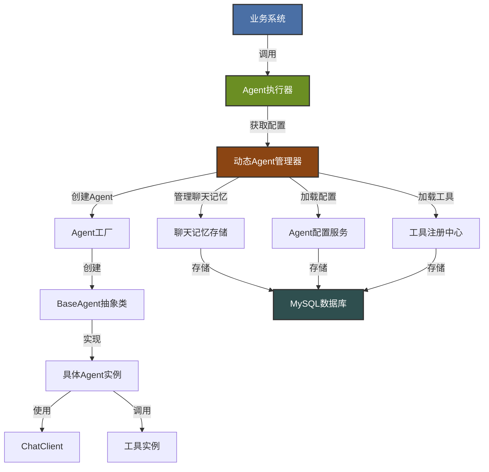
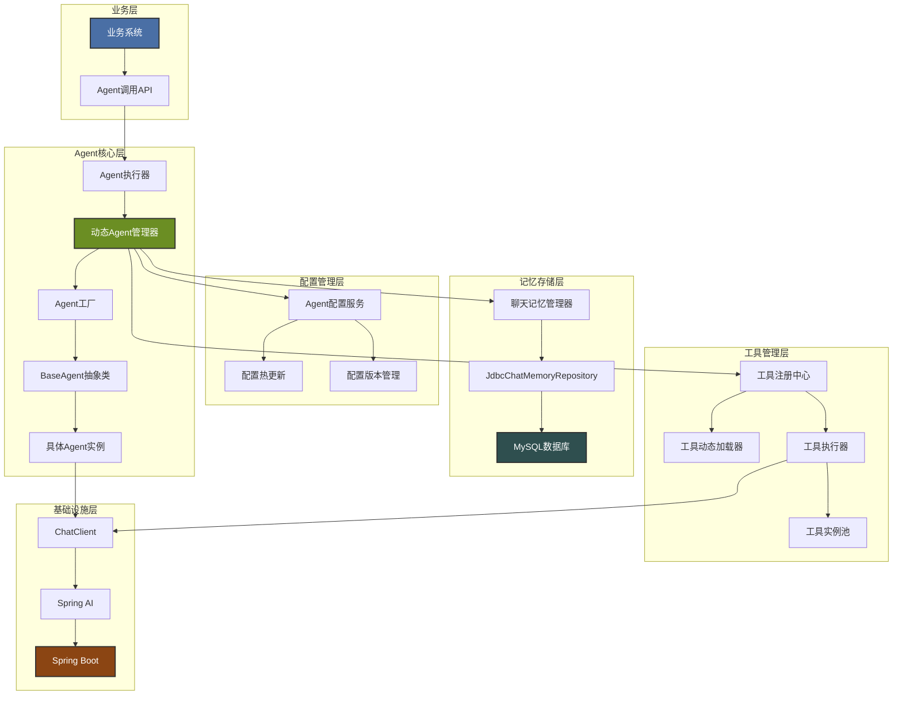
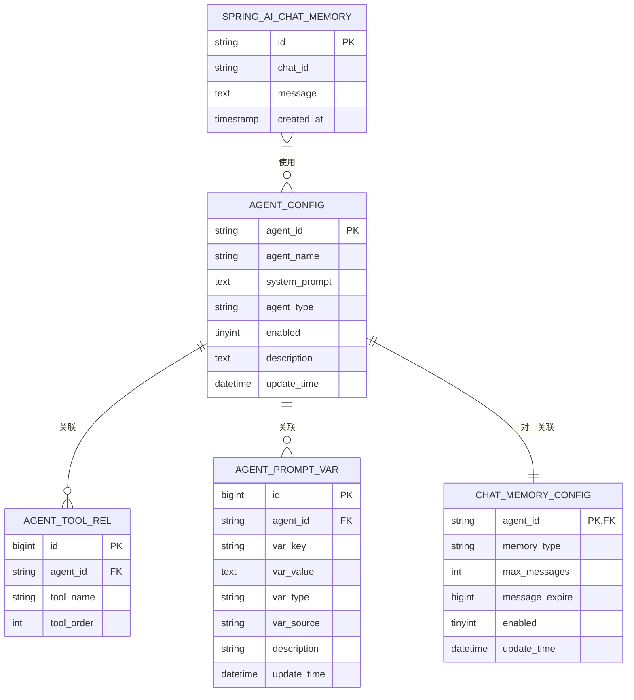

# FreeAgent

## 架构图

> **查看说明**：
> - IDEA默认不支持Mermaid图渲染，建议安装[Mermaid插件](https://plugins.jetbrains.com/plugin/20158-mermaid-ssr)或使用VS Code + Mermaid插件查看
> - 也可使用[Mermaid Live Editor](https://mermaid.live/)在线渲染查看

### 应用架构



### 功能架构



### 数据架构



## 1. 项目概述

FreeAgent是一个基于Spring AI的动态智能体（Agent）框架，提供灵活、可扩展的AI能力支持。该框架采用多种设计模式，实现了动态配置、聊天记忆存储和工具热插拔等核心功能，能够快速适应业务需求变化，降低开发和维护成本。

### 1.1 核心目标

- 提供灵活的动态Agent配置机制，无需修改代码即可创建和调整Agent
- 实现聊天记忆的持久化存储，支持多轮对话
- 支持工具的热插拔，无需重启应用即可扩展Agent能力
- 采用模块化设计，便于扩展和维护
- 提供统一的Agent管理和调用接口

### 1.2 技术栈

- Spring Boot
- Spring AI
- MySQL
- Feign
- 多种设计模式（模板模式、建造者模式、抽象工厂模式、策略模式）

## 2. 核心架构设计

### 2.1 设计模式

FreeAgent框架采用了多种设计模式，以提高代码的优雅性、灵活性和扩展性：

- **模板模式**：封装Agent的公共逻辑，提供抽象基类
- **建造者模式**：灵活构建Agent实例，支持链式调用
- **抽象工厂模式**：统一管理和创建不同类型的Agent
- **策略模式**：根据类型动态选择不同的处理策略

### 2.2 核心组件

#### 2.2.1 Agent接口

定义了Agent的基本行为，包括同步聊天和流式聊天两种方式。

```java
public interface Agent<T> {
    T chat(Request request, String type);
    void chatStream(Request request) throws Exception;
    // 请求数据模型
    class Request { /* ... */ }
    class ChatRequest extends Request { /* ... */ }
    class MultiRequest extends Request { /* ... */ }
}
```

#### 2.2.2 BaseAgent抽象类

实现了Agent接口的公共方法，封装了请求校验、上下文处理等公共逻辑，定义了抽象方法让具体Agent实现特定业务逻辑。

```java
public abstract class BaseAgent<T> implements Agent<T> {
    protected ChatClient chatClient;
    protected Map<String, Object> defaultContext;
    protected String systemPrompt;
    
    // 公共方法实现
    @Override
    public T chat(Request request, String type) {
        // 公共逻辑：参数校验、上下文处理
        return doChat(request, type);
    }
    
    // 抽象方法，由具体Agent实现
    protected abstract T doChat(Request request, String type);
    protected abstract void doChatStream(Request request) throws Exception;
    
    // 其他公共方法和属性
}
```

#### 2.2.3 AgentBuilder建造者类

用于灵活构建Agent实例，支持链式调用，配置Agent的各种属性和依赖。

```java
public class AgentBuilder<T extends BaseAgent<?>> {
    // 配置方法
    public AgentBuilder<T> withChatClient(ChatClient chatClient) { /* ... */ }
    public AgentBuilder<T> withSystemPrompt(String systemPrompt) { /* ... */ }
    public AgentBuilder<T> addDefaultContext(String key, Object value) { /* ... */ }
    
    // 构建Agent实例
    public T build() { /* ... */ }
}
```

#### 2.2.4 AgentFactory工厂接口

定义了Agent创建方法，支持根据类型创建不同类型的Agent。

```java
public interface AgentFactory {
    <T> Agent<T> createAgent(String agentType);
    <T> Agent<T> createAgent(String agentType, AgentConfig config);
}
```

#### 2.2.5 DefaultAgentFactory实现类

实现了AgentFactory接口，用于创建不同类型的Agent实例。

```java
@Component
public class DefaultAgentFactory implements AgentFactory {
    @Override
    public <T> Agent<T> createAgent(String agentType) {
        // 根据类型创建Agent实例
    }
    
    @Override
    public <T> Agent<T> createAgent(String agentType, AgentConfig config) {
        // 根据类型和配置创建Agent实例
    }
}
```

## 3. 动态Agent配置

### 3.1 设计理念

动态Agent配置允许通过数据库配置Agent，无需修改代码即可创建和调整Agent。这种设计具有以下优势：

- **灵活配置**：通过数据库配置Agent，无需修改代码即可创建和调整Agent
- **动态扩展**：支持业务侧动态传入提示词变量，满足不同场景需求
- **统一管理**：集中管理所有Agent配置，便于监控和维护
- **版本控制**：支持配置版本管理和审计，便于回滚和追踪
- **高可用性**：支持配置模板，快速创建相似Agent
- **松耦合**：Agent配置与业务代码分离，提高系统的可维护性

### 3.2 核心组件

#### 3.2.1 DynamicAgentManager

动态Agent管理器负责从数据库加载Agent配置，创建和管理Agent实例。

```java
@Component
public class DynamicAgentManager {
    
    @Autowired
    private JdbcChatMemoryRepository chatMemoryRepository;
    
    /**
     * 从数据库加载Agent配置并创建Agent实例
     */
    @PostConstruct
    public void init() {
        // 实现代码
    }
    
    /**
     * 根据配置创建聊天记忆实例
     */
    private ChatMemory createChatMemory(ChatMemoryConfig config, String chatId) {
        // 实现代码
    }
    
    /**
     * 动态加载Agent工具
     */
    private List<Object> loadTools(String agentId) {
        // 实现代码
    }
}
```

#### 3.2.2 AgentConfigService

Agent配置服务，用于从数据库获取Agent配置信息。

```java
public interface AgentConfigService {
    AgentConfig getAgentConfig(String agentName);
    List<AgentConfig> getAllAgentConfigs();
    void saveAgentConfig(AgentConfig config);
    void updateAgentConfig(AgentConfig config);
    void deleteAgentConfig(String agentName);
}
```

#### 3.2.3 AgentConfigFeignClient

Feign客户端，用于远程访问Agent配置服务。

```java
@FeignClient(name = "agent-config-service")
public interface AgentConfigFeignClient extends AgentConfigService {
    // 继承AgentConfigService接口的所有方法
}
```

## 4. 聊天记忆存储

### 4.1 概述

Spring AI提供了强大的聊天记忆功能，允许AI系统在对话过程中保留上下文信息，从而提供更连贯、更个性化的交互体验。
FreeAgent集成了Spring AI的聊天记忆功能，并将其存储到MySQL数据库中。

### 4.2 核心组件

#### 4.2.1 ChatMemory接口

`ChatMemory`是Spring AI中聊天记忆的核心接口，定义了存储和检索聊天记录的基本方法：

```java
public interface ChatMemory {
    // 保存消息到记忆中
    void add(ChatMessage message);
    // 获取记忆中的消息列表
    List<ChatMessage> getMessages();
    // 清除记忆
    void clear();
}
```

#### 4.2.2 MessageWindowChatMemory

`MessageWindowChatMemory`是`ChatMemory`接口的一个实现，它只保存最近的N条消息，超过限制的消息会被自动丢弃。

#### 4.2.3 JdbcChatMemoryRepository

`JdbcChatMemoryRepository`是`ChatMemoryRepository`接口的实现，用于将聊天记忆存储到关系型数据库中，包括MySQL。

### 4.3 配置实现

#### 4.3.1 ChatMemoryConfig配置类

```java
@Configuration
public class ChatMemoryConfig {
    
    @Autowired
    private DataSource dataSource;
    
    @Bean
    public JdbcChatMemoryRepository chatMemoryRepository() {
        JdbcTemplate jdbcTemplate = new JdbcTemplate(dataSource);
        return JdbcChatMemoryRepository.builder()
                .jdbcTemplate(jdbcTemplate)
                .dialect(JdbcChatMemoryRepositoryDialect.from(dataSource))
                .build();
    }
    
    @Bean
    public MessageWindowChatMemory defaultChatMemory() {
        return MessageWindowChatMemory.builder()
                .chatMemoryRepository(chatMemoryRepository())
                .maxMessages(10)
                .build();
    }
}
```

#### 4.3.2 配置文件

```yaml
spring:
  ai:
    chat:
      memory:
        repository:
          jdbc:
            initialize-schema: always
            platform: mysql
```

### 4.4 工作流程

1. 当用户与AI系统进行对话时，每条消息都会被添加到`ChatMemory`中
2. `MessageWindowChatMemory`会检查消息数量是否超过限制，如果超过则丢弃最旧的消息
3. 消息会通过`JdbcChatMemoryRepository`保存到MySQL数据库中
4. 当需要获取上下文时，`JdbcChatMemoryRepository`会从数据库中检索指定`chat_id`的最近N条消息

## 5. 工具热插拔

### 5.1 设计目标

- **动态加载**：无需重启应用即可添加新工具
- **低耦合**：减少与Spring bean的强耦合
- **版本管理**：支持工具的版本管理
- **安全可控**：支持工具的权限管理和审计
- **易用性**：提供简单的工具注册和使用接口

### 5.2 核心设计

#### 5.2.1 工具注册中心

```java
public interface ToolRegistry {
    // 注册工具
    void registerTool(ToolDefinition toolDefinition);
    
    // 注销工具
    void unregisterTool(String toolName);
    
    // 获取工具
    ToolDefinition getTool(String toolName);
    
    // 获取所有工具
    List<ToolDefinition> getAllTools();
    
    // 获取Agent可用工具
    List<ToolDefinition> getAgentTools(String agentName);
}
```

#### 5.2.2 工具定义

```java
@Data
public class ToolDefinition {
    private String toolName;            // 工具名称
    private String toolDescription;     // 工具描述
    private String className;           // 工具类名
    private String methodName;          // 工具方法名
    private List<ToolParameter> parameters; // 方法参数
    private String returnType;          // 返回类型
    private String version;             // 工具版本
    private boolean enabled;            // 是否启用
    private long createTime;            // 创建时间
    private long updateTime;            // 更新时间
}

@Data
public class ToolParameter {
    private String paramName;           // 参数名称
    private String paramType;           // 参数类型
    private String description;         // 参数描述
    private boolean required;           // 是否必填
    private String defaultValue;        // 默认值
}
```

#### 5.2.3 工具动态加载器

```java
public interface ToolLoader {
    // 从类名加载工具
    ToolDefinition loadToolFromClass(String className, String methodName);
    
    // 从JAR文件加载工具
    List<ToolDefinition> loadToolsFromJar(String jarPath);
    
    // 从配置加载工具
    ToolDefinition loadToolFromConfig(ToolConfig config);
}
```

#### 5.2.4 工具执行器

```java
public interface ToolExecutor {
    // 执行工具
    Object executeTool(String toolName, Map<String, Object> params);
    
    // 执行工具方法
    Object executeToolMethod(Object toolInstance, String methodName, Map<String, Object> params);
    
    // 获取工具实例
    Object getToolInstance(String toolName);
}
```

### 5.3 工具热插拔实现流程

1. **工具注册**：
   - 通过API或配置文件注册新工具
   - 工具定义存储到数据库
   - 工具类加载到JVM
   - 工具实例缓存到内存

2. **工具执行**：
   - Agent请求执行工具
   - 从ToolRegistry获取工具定义
   - 从缓存获取工具实例
   - 执行工具方法
   - 返回执行结果

3. **工具更新**：
   - 更新工具定义
   - 重新加载工具类
   - 更新内存缓存
   - 通知相关Agent

4. **工具卸载**：
   - 注销工具
   - 从内存缓存移除
   - 可选：从JVM卸载类

## 6. 数据库表结构

### 6.1 数模修改说明

#### 6.1.1 已完成修改

| 表名 | 字段名 | 数据类型 | 约束 | 描述 | 处理状态 |
|------|--------|----------|------|------|----------|
| agent_config | agent_id | VARCHAR(64) | PRIMARY KEY | Agent唯一标识符，UUID | 已实现 |
| agent_config | agent_name | VARCHAR(128) | UNIQUE NOT NULL | Agent名称，业务侧通过该名称访问 | 已实现 |
| agent_config | system_prompt | TEXT | NOT NULL | 系统提示词 | 已实现 |
| agent_config | agent_type | VARCHAR(64) | NOT NULL | Agent类型，如chat、tool、system等 | 已实现 |
| agent_config | enabled | TINYINT(1) | NOT NULL DEFAULT 1 | 是否启用，0=禁用，1=启用 | 已实现 |
| agent_config | description | TEXT | - | Agent描述信息 | 已实现 |
| agent_config | create_time | DATETIME | NOT NULL DEFAULT CURRENT_TIMESTAMP | 创建时间 | 数据库自动处理 |
| agent_config | update_time | DATETIME | NOT NULL DEFAULT CURRENT_TIMESTAMP ON UPDATE CURRENT_TIMESTAMP | 更新时间 | 数据库自动处理，代码预留字段 |

#### 6.1.2 功能字段预留

| 表名 | 字段名 | 数据类型 | 约束 | 描述 | 处理状态 |
|------|--------|----------|------|------|----------|
| agent_config | update_time | DATETIME | NOT NULL DEFAULT CURRENT_TIMESTAMP ON UPDATE CURRENT_TIMESTAMP | 更新时间 | 数据库自动处理，代码预留字段 |

### 6.2 核心实体关系

```
┌──────────────────┐       ┌──────────────────┐
│   agent_config   │       │ agent_tool_rel   │
├──────────────────┤       ├──────────────────┤
│ agent_id         │───┐   │ agent_id         │
│ agent_name       │   └───│ tool_name        │
│ system_prompt    │       └──────────────────┘
│ agent_type       │
│ enabled          │       ┌──────────────────┐
│ description      │       │agent_prompt_var  │
└──────────────────┘       ├──────────────────┤
                           │ agent_id         │
┌──────────────────┐       │ var_key          │
│ chat_memory_conf │       │ var_value        │
├──────────────────┤       │ var_type         │
│ agent_id         │       └──────────────────┘
│ memory_type      │
│ max_messages     │
│ message_expire   │
│ enabled          │
└──────────────────┘
```

### 6.2 详细表结构设计

#### 6.2.1 agent_config (Agent配置表)

| 字段名 | 数据类型 | 长度 | 约束 | 描述 |
|--------|----------|------|------|------|
| agent_id | VARCHAR | 64 | PRIMARY KEY | Agent唯一标识符，UUID |
| agent_name | VARCHAR | 128 | UNIQUE NOT NULL | Agent名称，业务侧通过该名称访问 |
| system_prompt | TEXT | - | NOT NULL | 系统提示词 |
| agent_type | VARCHAR | 64 | NOT NULL | Agent类型，如chat、tool、system等 |
| enabled | TINYINT | 1 | NOT NULL DEFAULT 1 | 是否启用，0=禁用，1=启用 |
| has_tools| TINYINT | 1 | NOT NULL DEFAULT 0 | 是否有工具，0=无，1=有 |
| description | TEXT | - | - | Agent描述信息 |
| update_time | DATETIME | - | NOT NULL DEFAULT CURRENT_TIMESTAMP ON UPDATE CURRENT_TIMESTAMP | 更新时间 |

#### 6.2.2 agent_tool_rel (Agent工具关联表)

| 字段名 | 数据类型 | 长度 | 约束 | 描述 |
|--------|----------|------|------|------|
| id | BIGINT | - | PRIMARY KEY AUTO_INCREMENT | 主键ID |
| agent_id | VARCHAR | 64 | NOT NULL | 关联的Agent ID |
| tool_name | VARCHAR | 128 | NOT NULL | 工具Bean名称，从Spring上下文中获取 |
| tool_order | INT | - | NOT NULL DEFAULT 0 | 工具执行顺序 |
| FOREIGN KEY (agent_id) REFERENCES agent_config(agent_id) ON DELETE CASCADE |

#### 6.2.3 agent_prompt_var (Agent提示词变量表)

| 字段名 | 数据类型 | 长度 | 约束 | 描述 |
|--------|----------|------|------|------|
| id | BIGINT | - | PRIMARY KEY AUTO_INCREMENT | 主键ID |
| agent_id | VARCHAR | 64 | NOT NULL | 关联的Agent ID |
| var_key | VARCHAR | 128 | NOT NULL | 变量键名 |
| var_value | TEXT | - | NOT NULL | 变量值，JSON格式存储 |
| var_type | VARCHAR | 32 | NOT NULL DEFAULT 'static' | 变量类型：static(静态)、dynamic(动态)、runtime(运行时) |
| var_source | VARCHAR | 64 | NOT NULL DEFAULT 'database' | 变量来源：database、business(业务侧传入)、system(系统提供) |
| description | VARCHAR | 256 | - | 变量描述 |
| update_time | DATETIME | - | NOT NULL DEFAULT CURRENT_TIMESTAMP ON UPDATE CURRENT_TIMESTAMP | 更新时间 |
| UNIQUE KEY (agent_id, var_key) |
| FOREIGN KEY (agent_id) REFERENCES agent_config(agent_id) ON DELETE CASCADE |

#### 6.2.4 chat_memory_config (聊天记忆配置表)

| 字段名 | 数据类型 | 长度 | 约束 | 描述 |
|--------|----------|------|------|------|
| agent_id | VARCHAR | 64 | PRIMARY KEY | 关联的Agent ID，一对一关系 |
| memory_type | VARCHAR | 64 | NOT NULL DEFAULT 'messageWindow' | 记忆类型：messageWindow、conversation等 |
| max_messages | INT | - | NOT NULL DEFAULT 10 | 最大消息数 |
| message_expire | BIGINT | - | NOT NULL DEFAULT 3600000 | 消息过期时间(毫秒) |
| enabled | TINYINT | 1 | NOT NULL DEFAULT 1 | 是否启用，0=禁用，1=启用 |
| update_time | DATETIME | - | NOT NULL DEFAULT CURRENT_TIMESTAMP ON UPDATE CURRENT_TIMESTAMP | 更新时间 |
| FOREIGN KEY (agent_id) REFERENCES agent_config(agent_id) ON DELETE CASCADE |

#### 6.2.5 spring_ai_chat_memory (智能体记忆表)

| 字段名 | 数据类型 | 长度 | 约束 | 描述 |
|--------|----------|------|------|------|
| id | VARCHAR | 255 | PRIMARY KEY | 消息唯一标识符 |
| chat_id | VARCHAR | 255 | NOT NULL | 聊天会话标识符，用于区分不同的对话 |
| message | TEXT | - | NOT NULL | 聊天消息内容 |
| created_at | TIMESTAMP | - | NOT NULL DEFAULT CURRENT_TIMESTAMP | 消息创建时间 |
| INDEX idx_chat_id (chat_id) |
| INDEX idx_created_at (created_at) |

#### 6.2.6  sse_message(SSE会话记忆表)

| 字段名 | 数据类型 | 长度  | 约束 | 描述 |
|--------|----------|-----|------|------|
| id | VARCHAR | 255 | PRIMARY KEY | 消息唯一标识符 |
| user_id | VARCHAR | 64  | NOT NULL | 用户唯一标识符，参考UserContextHolder获取 |
| session_id | VARCHAR | -   | NOT NULL | 会话唯一标识符，与session_info表关联 |
| connect_id | VARCHAR | -   | NOT NULL | 连接唯一标识符，关联SSE连接 |
| agent_id | VARCHAR | 64  | NOT NULL | 智能体唯一标识符 |
| message_type | VARCHAR | 64 | NOT NULL | 类型：message(普通消息)、log(日志消息)、error(错误消息)、table(表格消息) |
| message_content | TEXT | - | NOT NULL | 消息内容 |
| send_time | TIMESTAMP | - | NOT NULL DEFAULT CURRENT_TIMESTAMP | 消息发送时间 |
| is_deleted | TINYINT | 1 | NOT NULL DEFAULT 0 | 是否删除，0=未删除，1=已删除 |
| INDEX idx_chat_id (chat_id) |
| INDEX idx_created_at (created_at) |

#### 6.2.7  session_info(会话信息表，用于存储会话的生命周期和元数据)

| 字段名 | 数据类型 | 长度 | 约束 | 描述 |
|--------|----------|---|------|------|
| session_id | VARCHAR | 64 | PRIMARY KEY | 会话唯一标识符 |
| user_id | VARCHAR | 64 | NOT NULL | 用户唯一标识符，参考UserContextHolder获取 |
| session_name | VARCHAR | 255 | NOT NULL | 会话名称，默认使用第一个用户消息作为名称 |
| is_active | TINYINT | 1 | NOT NULL | 会话是否活跃，0=不活跃，1=活跃，2=弃用 |

## 7. 使用指南

### 7.1 基本使用

#### 7.1.1 通过AgentFactory获取Agent

```java
@Autowired
private AgentFactory agentFactory;

// 获取信息提取Agent
Agent<MetricInfo> infoExtractAgent = agentFactory.createAgent(AgentType.INFO_EXTRACT);

// 构建请求
Agent.ChatRequest request = Agent.ChatRequest.builder()
    .message("今天的指标数据如何？")
    .context(Map.of("userId", "123"))
    .build();

// 调用Agent进行聊天
MetricInfo result = infoExtractAgent.chat(request, "info_extract");
```

#### 7.1.2 使用AgentBuilder构建Agent

```java
@Autowired
private ChatClient chatClient;

// 构建信息提取Agent
InfoExtractAgent infoExtractAgent = AgentBuilder.create()
    .withAgentClass(InfoExtractAgent.class)
    .withChatClient(chatClient)
    .withSystemPrompt(QuestionIndexPromptConstant.SYSTEM_INTENT_INFO)
    .addDefaultContext("key", "value")
    .build();
```

#### 7.1.3 流式聊天示例

```java
// 构建流式请求
Agent.Request request = Agent.Request.builder()
    .connId("sse-123")
    .isStreaming(true)
    .build();

// 调用流式聊天
infoExtractAgent.chatStream(request);
```

### 7.2 动态Agent使用

#### 7.2.1 业务侧执行请求

```java
// 1. 注入AgentExecutor
@Autowired
private AgentExecutor agentExecutor;

// 2. 准备动态提示词变量
Map<String, Object> dynamicVars = new HashMap<>();
dynamicVars.put("user_id", "123456");
dynamicVars.put("location", "北京");
dynamicVars.put("current_date", LocalDate.now().toString());

// 3. 创建执行请求
AgentExecuteRequest request = AgentExecuteRequest.builder()
        .agentName("weatherAgent")
        .message("今天天气怎么样？")
        .dynamicPromptVariables(dynamicVars)
        .type("chat")
        .isStreaming(false)
        .build();

// 4. 执行Agent任务
Object result = agentExecutor.execute(request);
```

#### 7.2.2 AgentExecuteRequest结构

```java
@Data
@Builder
public class AgentExecuteRequest {
    /**
     * Agent名称
     */
    private String agentName;
    
    /**
     * 聊天消息
     */
    private String message;
    
    /**
     * 动态提示词变量，业务侧传入
     */
    private Map<String, Object> dynamicPromptVariables;
    
    /**
     * 请求类型
     */
    private String type;
    
    /**
     * 是否流式响应
     */
    private boolean isStreaming;
}
```

## 8. 扩展与开发

### 8.1 扩展新的Agent

#### 8.1.1 创建Agent类

创建一个新的Agent类，继承BaseAgent抽象类，实现doChat和doChatStream方法。

```java
@Component
public class NewAgent extends BaseAgent<NewResult> {
    
    @Autowired
    public NewAgent(ChatClient chatClient) {
        super(chatClient, "system-prompt-for-new-agent");
    }
    
    @Override
    protected NewResult doChat(Agent.Request request, String type) {
        // 实现特定业务逻辑
    }
    
    @Override
    protected void doChatStream(Agent.Request request) throws Exception {
        // 实现流式聊天逻辑
    }
}
```

#### 8.1.2 在AgentType中添加类型常量

```java
public class AgentType {
    public static final String NEW_AGENT = "new_agent";
    // 其他类型常量
}
```

#### 8.1.3 在DefaultAgentFactory中添加创建方法

```java
private NewAgent createNewAgent(AgentConfig config) {
    return new NewAgent(config.getChatClient());
}
```

#### 8.1.4 在switch语句中添加case

```java
@Override
public <T> Agent<T> createAgent(String agentType, AgentConfig config) {
    switch (agentType) {
        case AgentType.NEW_AGENT:
            return (Agent<T>) createNewAgent(config);
        // 其他case
        default:
            throw new IllegalArgumentException("Unknown agent type: " + agentType);
    }
}
```

### 8.2 开发新工具

#### 8.2.1 创建工具类

```java
@Component
public class NewTool {
    
    @Tool(description = "工具描述")
    public String newToolMethod(@ToolParam(description = "参数描述") String param1,@ToolParam(description = "参数描述") int param2) {
        // 实现工具逻辑
        return "工具执行结果";
    }
}
```

#### 8.2.2 注册工具

```java
@Autowired
private ToolRegistry toolRegistry;

public void registerNewTool() {
    ToolDefinition toolDefinition = new ToolDefinition();
    toolDefinition.setToolName("newTool");
    toolDefinition.setToolDescription("新工具描述");
    toolDefinition.setClassName("com.example.NewTool");
    toolDefinition.setMethodName("newToolMethod");
    // 设置其他属性
    
    toolRegistry.registerTool(toolDefinition);
}
```

## 9. 最佳实践

### 9.1 设计原则

1. **代码更优雅**：减少重复代码，结构更清晰
2. **更灵活**：支持动态配置Agent的各种属性和依赖
3. **扩展性更强**：添加新Agent只需实现特定接口，无需修改现有代码
4. **可测试性更好**：支持mock依赖，方便单元测试
5. **符合开闭原则**：对扩展开放，对修改关闭
6. **统一管理**：通过AgentFactory统一管理和创建Agent实例

### 9.2 使用建议

1. **继承BaseAgent**：所有新的Agent都应该继承BaseAgent抽象类
2. **使用AgentFactory**：通过AgentFactory获取Agent实例，而不是直接注入
3. **合理使用AgentBuilder**：对于需要动态配置的场景，使用AgentBuilder构建Agent
4. **遵循命名规范**：Agent类名使用XXXAgent命名，类型常量使用小写下划线命名
5. **实现特定抽象方法**：只需要实现doChat和doChatStream方法，无需关心公共逻辑
6. **合理设置maxMessages**：根据业务需求和内存限制，合理设置最大消息数，建议值为5-20
7. **使用唯一的chat_id**：为每个对话生成唯一的chat_id，避免不同对话之间的上下文混淆
8. **定期清理旧数据**：可以设置定时任务，清理过期的聊天记录，释放数据库空间
9. **监控数据库性能**：关注数据库的查询性能，必要时添加索引或优化查询
10. **考虑数据隐私**：聊天记录可能包含敏感信息，建议加密存储或定期脱敏处理

## 10. 未来规划

1. **支持配置热更新**：无需重启应用即可更新Agent配置
2. **支持A/B测试**：同一Agent支持多个配置版本，用于测试和比较
3. **支持配置推送**：配置更新后自动推送至所有节点
4. **支持配置验证**：配置变更时进行语法和逻辑验证
5. **支持配置可视化**：提供Web界面管理Agent配置
6. **支持多版本配置**：实现配置的版本管理和回滚
7. **支持配置模板**：提供配置模板，快速创建相似Agent
8. **支持配置审计**：实现配置变更的审计和追踪

## 11. 现有Agent类型

| Agent类型 | 描述 | 用途 |
| --- | --- | --- |
| data_board_extract | 数据看板提取Agent | 提取数据看板相关信息 |
| document | 文档处理Agent | 处理文档生成、图表生成等 |
| info_extract | 信息提取Agent | 提取指标相关信息 |
| load_check | 负载检查Agent | 进行负荷排查 |
| metric_result | 指标结果Agent | 生成指标结果 |
| simple_chat | 简单聊天客户端 | 示例聊天客户端 |
| system | 系统Agent | 系统级意图识别 |

## 12. 项目加载流程

### 12.1 启动入口

**`MetricAiMain`**（主启动类）
- **功能**：项目启动入口，初始化Spring Boot应用上下文
- **调用关系**：
  - 启动Spring Boot应用
  - 初始化所有Spring Bean

### 12.2 初始化流程

**`StartupInitializer`**（项目启动初始化器）
- **功能**：统一管理项目初始化流程
- **调用关系**：
  - 实现`ApplicationRunner`接口，在Spring应用启动后执行
  - 调用`SqlInitializationService.init()`进行数据库初始化
  - 调用`DynamicAgentManager.init()`创建智能体

### 12.3 数据库初始化

**`SqlInitializationService`**（SQL初始化服务）
- **功能**：自动检测和初始化数据库表结构及数据
- **调用关系**：
  - 执行`sql/tables/`目录下的表结构脚本
  - 执行`sql/data/`目录下的初始数据脚本
  - 按表维度进行初始化：agent_config → agent_prompt_var → agent_tool_rel → chat_memory_config → spring_ai_chat_memory → session_info → sse_message

### 12.4 智能体配置加载

**`DynamicAgentManager`**（动态智能体管理器）
- **功能**：从数据库加载智能体配置，创建智能体实例
- **调用关系**：
  - 调用`AgentConfigRepository.findAllEnabledAgents()`加载智能体配置
  - 注册提示词模板到`PromptManager`
  - 为每个配置创建智能体实例

### 12.5 智能体创建

**`AgentBuilder`**（智能体构建器）
- **功能**：构建智能体实例
- **调用关系**：
  - 设置智能体类、ChatClient、名称和类型
  - 创建提示词模板并设置系统提示词
  - 调用`loadTools()`加载智能体工具
  - 配置ChatMemory
  - 注入SSE管理器
  - 构建并返回智能体实例

### 12.6 工具加载

**`loadTools()`**（工具加载方法）
- **功能**：根据工具名称列表加载工具实例
- **调用关系**：
  - 遍历智能体配置的工具名称列表
  - 从`ApplicationContext`获取工具Bean
  - 处理可能的循环依赖异常
  - 返回加载的工具实例列表

### 12.7 智能体实例化

**`GenericDynamicAgent`**（通用动态智能体）
- **功能**：智能体的具体实现
- **调用关系**：
  - 接收`AgentBuilder`的配置
  - 初始化智能体实例
  - 设置动态和运行时变量键名
  - 注册到`DynamicAgentManager`的agentMap中

### 12.8 服务就绪

**项目完全启动**
- **功能**：所有组件初始化完成，服务就绪
- **状态**：
  - 数据库表结构和初始数据已初始化
  - 所有智能体实例已创建
  - 服务监听指定端口（默认8503）
  - 接受外部请求

### 12.9 完整加载流程图

```
┌─────────────────────────┐
│  MetricAiMain           │
│  (Spring Boot启动)       │
└─────────────────────────┘
            │
            ▼
┌─────────────────────────┐
│  StartupInitializer      │
│  (统一初始化管理)         │
└─────────────────────────┘
            │
            ▼
┌─────────────────────────┐
│  SqlInitializationService │
│  (数据库初始化)           │
└─────────────────────────┘
            │
            ▼
┌─────────────────────────┐
│  DynamicAgentManager    │
│  (智能体配置加载)         │
└─────────────────────────┘
            │
            ▼
┌─────────────────────────┐
│  AgentBuilder           │
│  (智能体构建)           │
└─────────────────────────┘
            │
            ▼
┌─────────────────────────┐
│  loadTools()            │
│  (工具加载)             │
└─────────────────────────┘
            │
            ▼
┌─────────────────────────┐
│  GenericDynamicAgent    │
│  (智能体实例化)         │
└─────────────────────────┘
            │
            ▼
┌─────────────────────────┐
│  服务就绪               │
└─────────────────────────┘
```
